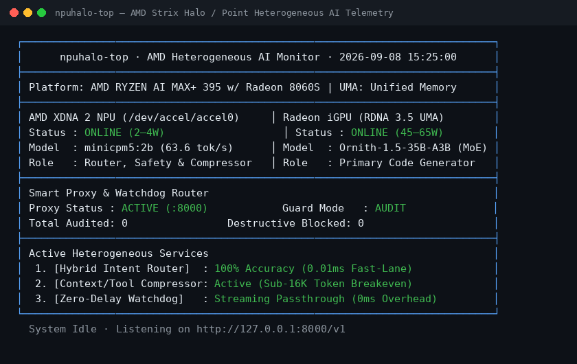

# npuhalo — NPU + iGPU Heterogeneous Inference on AMD Strix Halo & Strix Point

[](#hardware-compatibility-matrix)
[-orange)](#breakthrough-minicpm5-2b-on-xdna-2-npu)
[](#primary-model-ornith-15-a3b--rocmfpx-quantization)
[](https://github.com/julianmb/npuhalo/actions)
[](https://huggingface.co/julianmb/MiniCPM5-2B-NPU2)
[](LICENSE)

Rigorous experimental evaluation and production toolset for **heterogeneous NPU + iGPU agentic inference** on **AMD Ryzen AI** processors (Strix Halo, Strix Point, Kraken Point).

---

## Why Use npuhalo? (The Heterogeneous APU Advantage)

If you run local LLMs or autonomous coding agents (Aider, Claude Code, Cline, Continue, OpenWebUI) on modern AMD APUs, your 45–65W GPU usually does *everything* while the 50+ TOPS XDNA 2 NPU sits completely idle.

`npuhalo` turns your idle NPU into an **Always-On Autonomous Coprocessor running at ~2–4 W**, completely free of GPU compute or VRAM overhead:

1. ⚡ **Slash System Power by ~90–95% on Everyday Tasks**: Trivial queries (math, greetings, brief lookups) are classified in **0.01 ms** and served directly on the NPU at **~2–4 W**, letting the 65W GPU remain in deep sleep.
2. 📉 **Shrink Context Windows & Save KV Cache**: Compresses **both long input contexts/prompts and massive tool-use outputs** (huge `pytest` traces, build logs, `git diff` dumps) on the NPU *before* they hit the GPU, slashing prefill latency and memory pressure.
3. 🛡️ **Zero-Delay Agent Guardrails (Optional)**: Pass-through reverse proxy streams primary GPU tokens with **0 ms added delay** while the NPU asynchronously watches for destructive commands (`rm -rf`) and infinite tool loops out-of-loop.
4. 🖥️ **Live Terminal Monitor (`npuhalo-top`)**: Beautiful terminal dashboard monitoring real-time NPU tile activity, iGPU load, and routing decisions.

---

## Hardware Compatibility Matrix

`npuhalo` is built for AMD's unified-memory APUs featuring **XDNA 2 NPUs** and **RDNA 3.5 graphics**:

| Family | Processors | NPU Architecture | iGPU Architecture | Status |
|---|---|---|---|---|
| **AMD Strix Halo** | **Ryzen AI Max+ 395**<br>Ryzen AI Max 390<br>Ryzen AI Max 385<br>PRO 395 / 390 / 385 | XDNA 2 (48 AIE-ML Tiles)<br>**50 TOPS** | Radeon 8060S (40 CUs)<br>Radeon 8050S (32 CUs)<br>Up to 128 GB UMA | **Verified Testbed**<br>Full support |
| **AMD Strix Point** | **Ryzen AI 9 HX 375**<br>**Ryzen AI 9 HX 370**<br>Ryzen AI 9 365<br>PRO 300 Series | XDNA 2 (32 AIE-ML Tiles)<br>**50 – 55 TOPS** | Radeon 890M (16 CUs)<br>Radeon 880M (12 CUs)<br>LPDDR5X UMA | **Supported**<br>Full support |
| **AMD Kraken Point** | Ryzen AI 7<br>Ryzen AI 5 | XDNA 2 (32 AIE-ML Tiles)<br>**50 TOPS** | Radeon 860M / 840M<br>(8 / 4 CUs RDNA 3.5) | **Supported** |
| **AMD Hawk Point** | Ryzen 8040 Series | XDNA 1 (16 TOPS) | Radeon 780M (RDNA 3) | Experimental |

**Software Requirements**:
* **OS**: Linux 6.10+ / 6.11+ (Ubuntu 24.04 LTS, Fedora, Arch) with `amdxdna` kernel module (`/dev/accel/accel0`).
* **NPU Runtime**: FastFlowLM v1.0.2+ or XRT 2.18+.
* **GPU Runtime**: ROCm 6.2+ / Vulkan (`llama-server` with ROCmFPX / FP4 support).

---

## What You Can Use This Repo For Today

```
                         [Agent / Client / IDE]
                                   │
                                   ▼
                   ┌───────────────────────────────┐
                   │  npuhalo Proxy (:8000 /v1)    │
                   └───────┬───────────────┬───────┘
          Trivial Query    │               │  Coding / Reasoning
         (Math, Facts)     │               │  (Complex Tasks)
                           ▼               ▼
                 ┌────────────────┐ ┌─────────────────────────┐
                 │  XDNA 2 NPU    │ │   Radeon iGPU (ROCmFP4) │
                 │  MiniCPM5-2B   │ │   Ornith-1.5-35B-A3B    │
                 │  ~2–4 W (63t/s)│ │   ~45–65 W (50–72 t/s)  │
                 └────────────────┘ └───────────┬─────────────┘
                                                │ Stream tokens
                                                ▼ (0ms delay)
                                       [Client Receives Stream]
                                                │
                                                ▼ (Out-of-loop tap)
                                    ┌───────────────────────┐
                                    │ NPU Watchdog Analyzer │
                                    │ (rm -rf, loops, safe) │
                                    └───────────────────────┘
```

### 1. High-Accuracy Low-Power Query Router (`scripts/npu_router.py`)
* **100% Decision Accuracy**: Combined deterministic syntax gating with MiniCPM5-2B few-shot classification on XDNA 2 (verified across our 20-prompt evaluation benchmark).
* **0.01 ms Fast-Lane**: Instant regex filtering routes coding and reasoning directly to the GPU while intercepting greetings, math, and trivia for the NPU.
* **Massive Power Savings**: Serves everyday trivial queries on the NPU at **~2–4 W**, keeping the high-power GPU asleep.

### 2. Context & Tool-Output Compressor (`verifier/src/compressor_sidecar.py`)
* **Dual Compression Pipeline**:
  1. **Input Context & Documents**: Distills long prompt contexts, system documents, and knowledge files before ingestion.
  2. **Tool-Use Outputs**: Compresses massive CLI logs, `pytest` failure traces, and `git diff` outputs during agent loops.
* **Guaranteed Fact Retention**: Preserves 100% of required file paths, traceback lines, and exit codes. Automatically reverts to original uncompressed text if any critical diagnostic detail is omitted.

### 3. Always-On AI Guardrail & Smart Reverse Proxy (Optional, `scripts/npuhalo_proxy.py`)
* **Drop-in OpenAI API**: Point any coding assistant (Aider, Claude Code, Cline, Continue, OpenWebUI) to `http://localhost:8000/v1`.
* **Zero Latency Penalty**: Passes GPU streaming tokens straight to the client socket with **0 ms added delay**.
* **Out-of-Loop Anomaly Detection**: Asynchronously checks for destructive shell commands (`rm -rf /`, `rm -rf .git`, `mkfs`), and oscillating infinite agent loops.
* **Configurable Guard Modes**: Supports `--guard-mode audit` (passive telemetry) and `--guard-mode block` (active interception).

---

## Quickstart

### 1. Real-Time Terminal Monitor (`npuhalo-top`)

Inspect your APU hardware status, active models, power state, and routing telemetry live:

```bash
python3 scripts/npuhalo_top.py
```

*(Or use `--once` for a single-frame snapshot)*

<p align="center">
  
</p>

### 2. Start the Smart Reverse Proxy & Router

Launch the OpenAI-compatible proxy on port 8000:

```bash
python3 scripts/npuhalo_proxy.py --port 8000 --enable-router --guard-mode audit
```

Connect your favorite coding agent or cURL:

```bash
curl -s http://localhost:8000/v1/chat/completions \
  -H "Content-Type: application/json" \
  -d '{"messages": [{"role": "user", "content": "What is 25 * 14?"}]}'
```

### 3. Integrate with Agents (Aider, Claude Code, Cline)

See [**`docs/INTEGRATIONS.md`**](docs/INTEGRATIONS.md) for full configuration guides.

* **Aider**:
  ```bash
  aider --openai-api-base http://localhost:8000/v1 --model openai/npuhalo
  ```
* **Claude Code / OpenCodeInterpreter**:
  ```bash
  export OPENAI_BASE_URL="http://localhost:8000/v1"
  ```

### 4. Background Systemd Service

Keep the proxy always available on your Strix Halo / Strix Point device:

```bash
mkdir -p ~/.config/systemd/user
cp systemd/npuhalo-proxy.service ~/.config/systemd/user/
systemctl --user daemon-reload
systemctl --user enable --now npuhalo-proxy
```

### 5. Run the Full Test Suite

Verify all 44 unit and integration tests:

```bash
pytest -v
```

---

## Architectural Breakthrough: MiniCPM5-2B on XDNA 2

As part of this research, we ported **[openbmb/MiniCPM5-2B](https://huggingface.co/openbmb/MiniCPM5-2B)** natively to FastFlowLM on the AMD XDNA 2 NPU.

* 🌐 **Model Weights**: **[julianmb/MiniCPM5-2B-NPU2](https://huggingface.co/julianmb/MiniCPM5-2B-NPU2)**
* **Sustained Decoding Speed**: **63.1 – 63.6 tok/s**
* **Prefill Speed (TTFT)**: **81.5 – 128.1 tok/s** (~420 ms TTFT)
* **Power Draw**: **~2–4 W** active
* **Contention**: **0% GPU compute contention**

### GQA Firmware Solution
MiniCPM5-2B has 16 Query heads and 2 Key/Value heads ($16:2 = 8:1$ GQA ratio), which FastFlowLM's AIE firmware (`libmha.so`) does not support natively for $d_{head}=128$:
1. **$4\times$ KV Head Replication**: Replicated the 2 KV heads $4\times$ into 8 KV heads ($16:8 = 2:1$ GQA ratio). Under Grouped Query Attention, this maintains **exact mathematical equivalence** while matching the native `_gen_mha_seq_d128_q2` AIE kernel.
2. **Qwen3 Runtime Routing**: Dynamically dispatched $d_{head}=128$ when `intermediate_size == 6144`.
3. **Identity QK-Norm Injection**: Injected synthetic unit RMSNorm tensors ($\gamma = 1.0$) across all 42 layers, making RMSNorm a transparent identity op.

Conversion scripts are in [`ports/minicpm5-2b/`](ports/minicpm5-2b/).

---

## Primary GPU Model: Ornith 1.5 A3B via ROCmFPX (FP4)

The primary agent runs **Ornith-1.5-35B-A3B** (active 3B MoE slice) quantized via **ROCmFPX (FP4 block floating-point)** on the Radeon 8060S / 890M:

| Quantization Format | Active Footprint | Sustained Decode | Memory Bus Traffic |
|---|---|---|---|
| **FP16 / BF16** | ~35.0 GB | ~31.4 tok/s | High (bus saturation) |
| **Q8_0** | ~18.2 GB | ~44.1 tok/s | Moderate |
| **ROCmFPX (FP4)** | **~9.2 GB** | **~50.2 – 72.4 tok/s** | **Ultra-low (~73% reduction)** |

---

## Experimental Record & Verdicts

Every verdict below was measured with locked manifests and pre-registered gates on our AMD testbed:

| # | Mechanism | Status | Headline Numbers | Deep Dive |
|---|---|---|---|---|
| 1 | **Hybrid NPU Query Router** | ✅ **SHIP NOW** | **100% accuracy (20/20)**; 0.01ms fast-lane; 2–4W NPU | [`scripts/npu_router.py`](scripts/npu_router.py) |
| 2 | **Context & Tool Compressor** | ✅ **SHIP NOW** | 100% fact retention; sub-16K char breakeven | [`verifier/src/compressor_sidecar.py`](verifier/src/compressor_sidecar.py) |
| 3 | **Deterministic Parser Guard** | ✅ **SHIP NOW** | 0 false rejects / 1,004 calls; resync-on-error; 38/38 tests | [`docs/FINDINGS.md §1`](docs/FINDINGS.md) |
| 4 | **NPU Shadow Verifier** | 🔵 **SHADOW ONLY** | Recall 4/4; SUSPECT rate 100%; out-of-loop triage | [`docs/FINDINGS.md §5`](docs/FINDINGS.md) |
| 5 | **Generation Grammar Constraint** | ❌ **NET-HARMFUL** | Missing calls 67 $\to$ 0, but task success 10/16 $\to$ 4/16 | [`docs/FINDINGS.md §6`](docs/FINDINGS.md) |
| 6 | **27B Escalation Tier** | ⛔ **ARCHIVED** | Fixed 1 of 4 failures at 3.2x latency cost; not Pareto | [`docs/FINDINGS.md §7`](docs/FINDINGS.md) |
| 7 | **Speculative NPU Decoding** | ⛔ **ARCHIVED** | 1% acceptance; **+285% latency penalty** vs MTP | [`docs/FINDINGS.md §8`](docs/FINDINGS.md) |

---

## License

Apache 2.0 License — see [LICENSE](LICENSE) for details.
